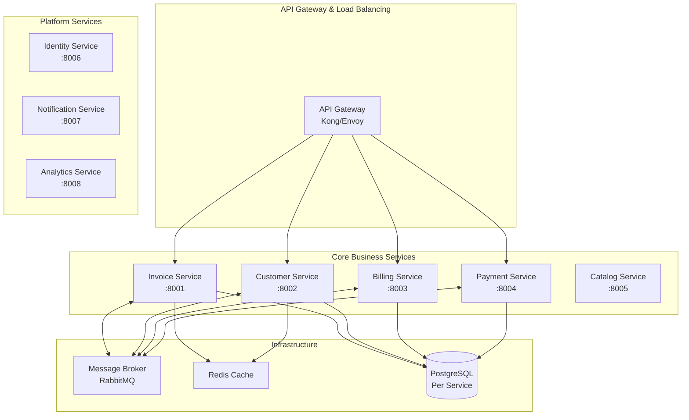

# 🧾 Invx - Multi-Tenant Invoicing Platform

> **A comprehensive backend engineering showcase demonstrating Domain-Driven Design, Clean Architecture, and event-driven microservices patterns.**

[](https://opensource.org/licenses/MIT)
[](https://dotnet.microsoft.com/)
[](https://www.postgresql.org/)
[](https://www.docker.com/)
[](https://github.com/ahmed-ismail-xy/invx-platform)

## 🎯 Project Vision

Invx is designed as a **multi-tenant SaaS platform** for small to mid-sized businesses to streamline their invoicing, billing, and customer management operations. This project serves as a comprehensive demonstration of modern backend engineering practices and enterprise-grade architecture patterns.

### 🏢 Business Problem Statement

Modern SMBs struggle with fragmented invoicing solutions that don't scale with their growth. Invx aims to address this by providing:

- **Unified Invoice Management**: From creation to payment collection
- **Flexible Billing Models**: One-time, recurring, usage-based, and hybrid billing
- **Multi-Tenant Architecture**: Secure tenant isolation with flexible deployment options
- **Enterprise Integration**: APIs, webhooks, and third-party service integrations
- **Compliance Ready**: Tax calculations, audit trails, and regulatory reporting

### 🎨 Architecture Philosophy

This project demonstrates **modern backend engineering** through:

- 🏗️ **Domain-Driven Design** → Bounded contexts and rich domain models
- 🧅 **Clean Architecture** → Dependency inversion and testable design
- 📡 **Event-Driven Integration** → Asynchronous, resilient service communication
- 🏢 **Multi-Tenancy Patterns** → Scalable tenant isolation strategies
- 📊 **CQRS & Event Sourcing** → Optimized read/write models with audit trails
- 🔍 **Observability First** → Comprehensive monitoring and tracing
- 🐳 **Cloud-Native Design** → Containerized microservices architecture

## 🚧 Development Status

**Current Progress: Early Development Phase**

### ✅ Completed
- [x] Project architecture design and planning
- [x] Technology stack selection and evaluation
- [x] Initial project structure and documentation
- [x] Core domain modeling for invoicing context
- [x] Clean Architecture foundation setup

### 🔨 In Progress
- [ ] **Invoice Service Implementation** (Primary Focus)
  - [ ] Domain entities and value objects
  - [ ] Application services and use cases
  - [ ] Infrastructure layer with PostgreSQL
  - [ ] API controllers and endpoints
  - [ ] Unit and integration tests

### 📋 Planned Features
- [ ] Complete Invoice microservice with full CRUD operations
- [ ] Customer Management service
- [ ] Billing and Payment processing services
- [ ] Identity and Authentication service
- [ ] API Gateway integration
- [ ] Event-driven communication between services
- [ ] Multi-tenant data isolation
- [ ] Observability and monitoring setup
- [ ] Docker containerization and Kubernetes deployment

## 🏛️ Planned System Architecture

### Target Microservices Architecture



### Technology Stack

| Layer | Technologies |
|-------|-------------|
| **API Gateway** | Kong/Envoy Gateway |
| **Services** | ASP.NET Core 9 Microservices |
| **API Design** | REST APIs with OpenAPI, GraphQL (planned) |
| **Application** | MediatR (CQRS), FluentValidation, AutoMapper |
| **Domain** | Rich Domain Models, Domain Events |
| **Data Access** | Entity Framework Core, PostgreSQL |
| **Messaging** | RabbitMQ for event-driven communication |
| **Caching** | Redis for performance optimization |
| **Testing** | xUnit, FluentAssertions, Testcontainers |
| **DevOps** | Docker, Kubernetes (planned), GitHub Actions |

## 🚀 Getting Started (Development Setup)

### Prerequisites
- [.NET 9 SDK](https://dotnet.microsoft.com/download)
- [Docker & Docker Compose](https://www.docker.com/)
- [PostgreSQL](https://www.postgresql.org/) (or run via Docker)

### Current Setup
```bash
# Clone the repository
git clone https://github.com/ahmed-ismail-xy/invx-platform.git
cd invx-platform

# Start infrastructure services
docker-compose -f docker-compose.infrastructure.yml up -d

# Run the Invoice service (currently in development)
cd src/Services/Invoice
dotnet run
```

**Note**: Full orchestration with docker-compose and Kubernetes will be available as more services are implemented.

## 📖 Documentation & Learning Resources

| Document | Status | Purpose |
|----------|--------|---------|
| [ARCHITECTURE.md](./docs/ARCHITECTURE.md) | 📝 Planned | Detailed system design and patterns |
| [DEVELOPMENT.md](./docs/DEVELOPMENT.md) | 📝 Planned | Development guidelines and standards |
| [API_DOCUMENTATION.md](./docs/API_DOCUMENTATION.md) | 📝 Planned | API specifications and examples |
| [DEPLOYMENT.md](./docs/DEPLOYMENT.md) | 📝 Planned | Production deployment guide |

## 🎖️ Engineering Principles Demonstrated

This project showcases **professional backend development practices**:

### **System Design & Architecture**
- Domain-Driven Design with proper bounded contexts
- Clean Architecture with clear separation of concerns
- Event-driven architecture patterns
- Multi-tenant SaaS design considerations

### **Code Quality & Best Practices**
- SOLID principles and dependency injection
- Comprehensive testing strategies (unit, integration, contract)
- Async/await patterns and proper error handling
- Clean code principles and maintainable design

### **Infrastructure & DevOps**
- Containerization with Docker
- Infrastructure as Code approaches
- CI/CD pipeline design
- Observability and monitoring strategies

### **Security & Compliance**
- Multi-tenant data isolation
- Authentication and authorization patterns
- Data protection and privacy considerations
- API security best practices

## 🗺️ Development Roadmap

### Phase 1: Foundation (Current)
- Complete Invoice Service implementation
- Establish testing patterns and CI/CD pipeline
- Set up basic infrastructure components

### Phase 2: Core Services
- Implement Customer and Billing services
- Add inter-service communication
- Integrate API Gateway

### Phase 3: Platform Services
- Identity and Authentication service
- Notification system
- Basic analytics and reporting

### Phase 4: Production Ready
- Kubernetes deployment
- Comprehensive monitoring and observability
- Performance optimization and scaling

## 🤝 Connect & Feedback

I'm actively developing this project to demonstrate modern backend engineering practices. Feedback, suggestions, and discussions about architecture decisions are welcome!

💼 **LinkedIn**: [Ahmed Ismail](https://www.linkedin.com/in/ahmed-ismail-xy/)  
📧 **Email**: [ahmedismailxy@gmail.com](mailto:ahmedismailxy@gmail.com)  
🐙 **GitHub**: [Follow for updates](https://github.com/ahmed-ismail-xy)

---

*This is an active development project showcasing enterprise-grade backend architecture. The codebase evolves continuously as new features and services are implemented.*